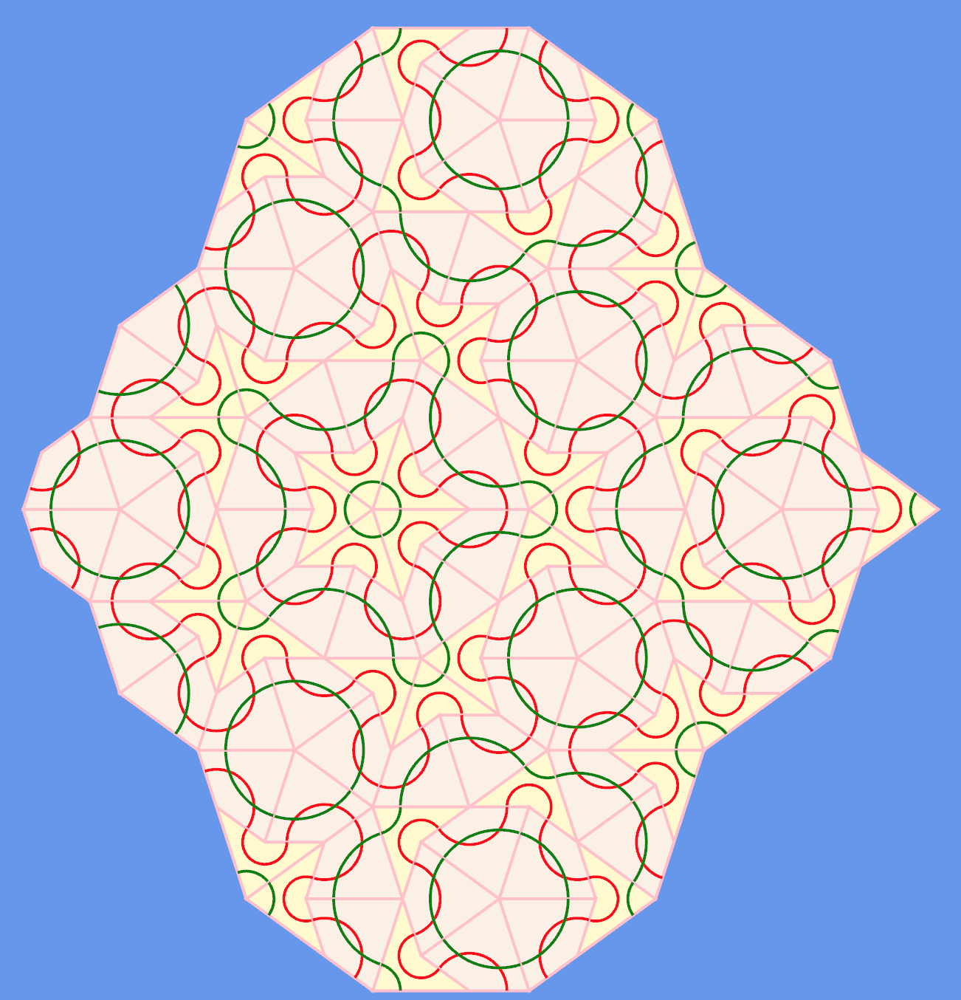
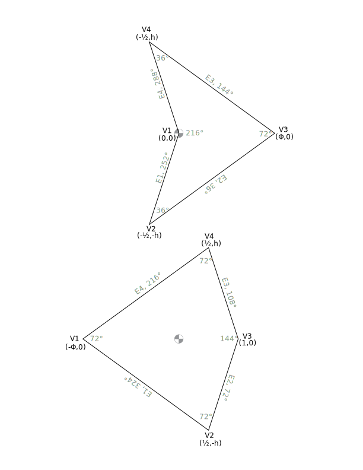

# Penrose
A simple Rust app for playing with penrose tile layouts.

currently limited to the Kite & Dart tile set. The geometry
of those tiles looks like this:

### Commands
* A - Toggle arcs
* B - Toggle Ammann bars
* C - Clear
* D - Use Dart tile
* E - Toggle edges
* K - Use Kite tile
* X - Enable debugging
* U - Remove last tile
* Up - Scale up
* Down - Scale down
* Left - Rotate left
* Right - Rotate right

### Modules used

* [nannou](https://nannou.cc/) Nannou framework
